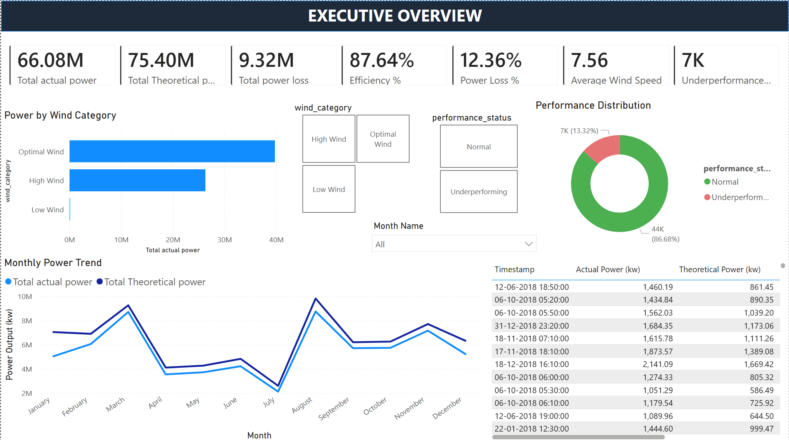
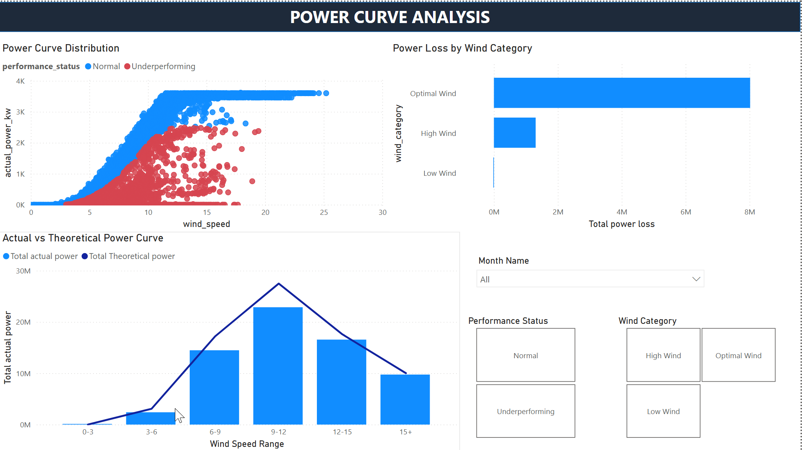
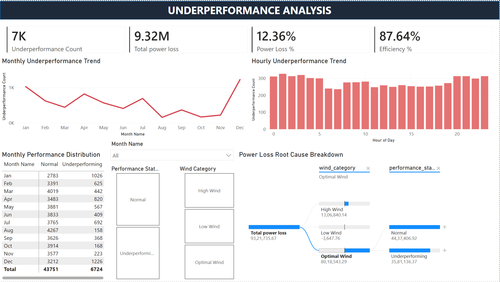
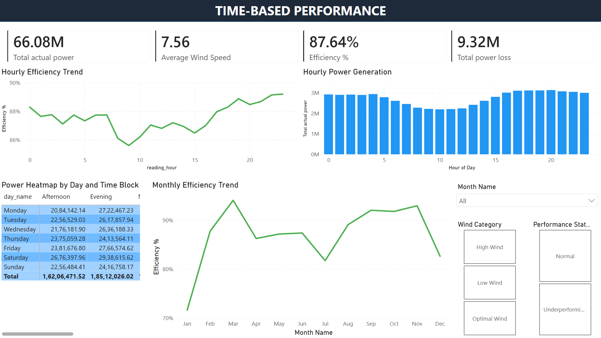

# Wind Turbine Performance Analytics

End-to-end Power BI and SQL analytics solution for wind turbine SCADA performance monitoring, power curve analysis, underperformance detection, and operational insights.

---

# Project Overview

This project focuses on analyzing wind turbine SCADA (Supervisory Control and Data Acquisition) data using SQL and Power BI to monitor turbine operational performance, power generation efficiency, underperformance trends, and time-based operational behavior.

The solution provides interactive dashboards for executive reporting, power curve monitoring, root cause analysis, and operational performance optimization.

---

# Tools & Technologies Used

- Power BI
- SQL
- DAX
- Power Query
- Data Modeling
- Data Visualization
- SCADA Analytics

---

# Key Features

- Executive KPI Dashboard
- Power Curve Analysis
- Underperformance Detection
- Time-Based Performance Monitoring
- Wind Category Analysis
- Root Cause Breakdown
- Interactive Slicers and Filters
- Operational Trend Analysis

---

# Key KPIs

| KPI | Description |
|---|---|
| Total Actual Power | Total generated turbine power |
| Total Theoretical Power | Expected turbine power generation |
| Efficiency % | Operational efficiency percentage |
| Power Loss % | Total operational power loss |
| Underperformance Count | Number of underperforming records |
| Average Wind Speed | Average turbine wind speed |

---

# Dashboard Pages

## 1. Executive Overview

Provides a high-level operational summary of turbine performance including KPIs, monthly power trends, wind category analysis, and performance distribution.



---

## 2. Power Curve Analysis

Analyzes actual vs theoretical turbine power curves across wind speed ranges and identifies underperformance behavior.



---

## 3. Underperformance Analysis

Tracks operational underperformance trends, hourly breakdowns, and root cause analysis of power loss.



---

## 4. Time-Based Performance

Monitors hourly efficiency, monthly efficiency trends, and time-block-based power generation patterns.



---

# SQL Work Included

The project includes SQL scripts for:

- Data cleaning
- Feature engineering
- Performance categorization
- Wind speed binning
- Time block creation
- Power loss analysis
- Operational trend analysis

Key transformations performed:
- Efficiency calculation
- Power loss calculation
- Wind category creation
- Performance status classification
- Monthly and hourly aggregations

---

# Repository Structure

```text
Wind-Turbine-Performance-Analytics/
│
├── Dashboards/
├── Datasets/
├── SQL/
├── Screenshots/
├── Insights/
└── README.md
```

---

# Business Insights

- Actual turbine power generation remained below theoretical power generation across multiple periods.
- Optimal wind conditions generated the highest operational output.
- Underperformance spikes were observed during specific months and operational hours.
- Power loss was significantly concentrated during underperforming operational states.
- Evening and afternoon operational windows generated higher power output.
- Efficiency fluctuations across months indicated operational variability.
- Root cause analysis identified wind category and performance status as key contributors to operational losses.

Detailed insights can be found in:

```text
Insights/business_insights.md
```

---

# Future Enhancements

- Real-time SCADA integration
- Predictive maintenance analytics
- Machine learning anomaly detection
- Turbine-level drill-through analysis
- Automated alert systems

---

# Author

Dheepsaran Vivekananth
